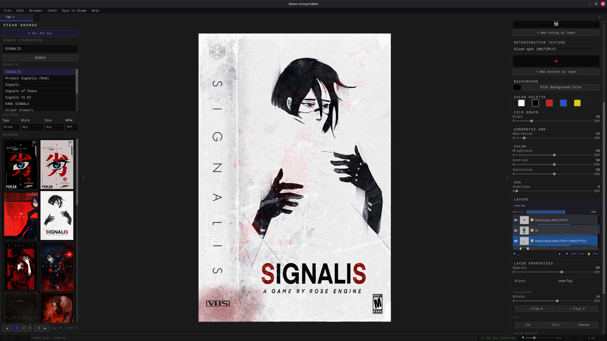
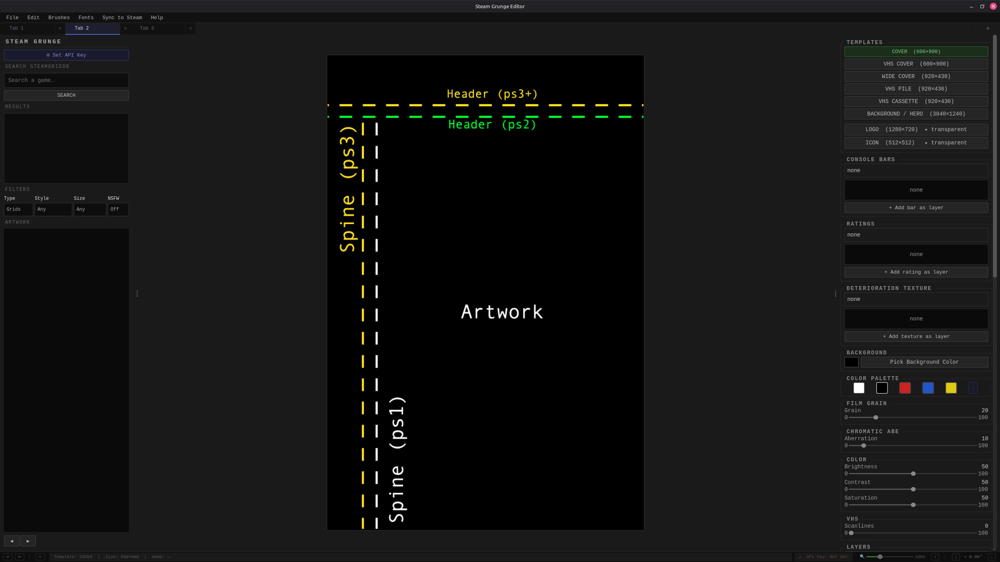
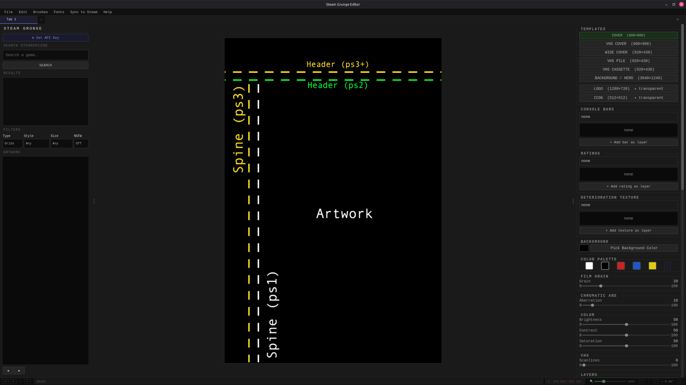
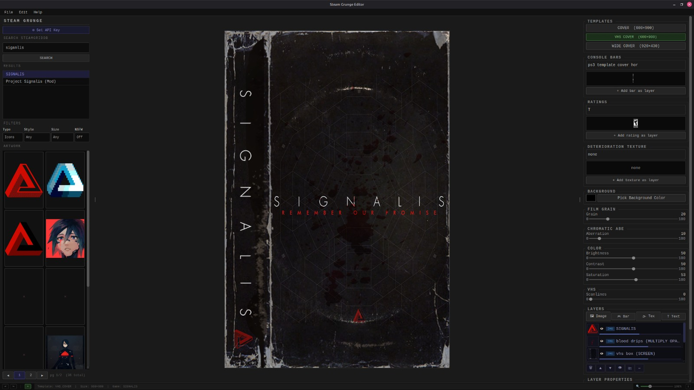

<div align="center">


# Steam Grunge Editor

**Create distressed, grunge-style custom artwork for your Steam library.**  
Search SteamGridDB, apply film grain and VHS effects, export with correct Steam filenames, and sync directly to Steam — all from one desktop app.

[](https://www.python.org/)
[](https://doc.qt.io/qtforpython/)
[]()
[](LICENSE)

</div>

---

## Screenshots


*Full editor — SteamGridDB search results, layer stack, and grunge effects applied to a VHS cover*


*Work on multiple games simultaneously — each tab has its own independent canvas and layers*


*Clean start — search any game and begin editing*


*Early beta — the app before templates and tabs were added*

---

## Features

- 🔍 **SteamGridDB Integration** — search and download game artwork directly inside the editor
- 🎨 **Layer-based canvas** — drag, resize, rotate, and blend multiple image layers
- 📼 **VHS & grunge effects** — film grain, chromatic aberration, scanlines, color grading
- 🖼️ **All Steam artwork types** — Cover, Wide Cover, VHS Cover, VHS Pile, VHS Cassette, Hero, Logo, Icon
- ✅ **Smart AppID detection** — auto-looks up the Steam AppID and confirms once per session
- 💾 **Correct filenames on export** — outputs `2050650.png`, `2050650p.png`, `2050650_hero.png`, etc.
- ⇪ **Sync to Steam** — copies exported files directly into your Steam `userdata/grid` folder
- 🖌️ **Custom brush engine** — import `.gbr`, `.png`, `.zip` brush packs with full pressure controls
- 🔤 **Font importer** — add `.ttf` / `.otf` fonts available in the text layer tool
- 🗂️ **Tab system** — work on multiple games at once, each tab has its own independent state
- 💼 **Project save/load** — save your full canvas and layer stack as a `.sgeproj` file; auto-saves every 5 minutes
- 🔔 **Auto update checker** — notified at launch when a new version is available on GitHub
- 🌑 **Dark terminal aesthetic** — monospace UI designed for the Steam grunge look

---

## Artwork Templates

| Template | Size | Background |
|---|---|---|
| Cover | 600 × 900 | Solid |
| VHS Cover | 600 × 900 | Solid |
| Wide Cover | 920 × 430 | Solid |
| VHS Pile | 920 × 430 | Solid |
| VHS Cassette | 920 × 430 | Solid |
| Background / Hero | 3840 × 1240 | Solid |
| Logo | 1280 × 720 | **Transparent** |
| Icon | 512 × 512 | **Transparent** |

---

## Installation

### 🪟 Windows

Download the latest `Steam_Grunge_Editor_Setup.exe` from [Releases](https://github.com/Huzzama/Steam-Grunge/releases), run it and follow the installer.

### 🍎 macOS (Big Sur 11.0+)

Download the latest `Steam_Grunge_Editor-x.x.x.dmg` from [Releases](https://github.com/Huzzama/Steam-Grunge/releases):

1. Open the `.dmg` file
2. Drag **Steam Grunge Editor** into your **Applications** folder
3. On first launch: right-click the app → **Open** (bypasses Gatekeeper unsigned warning)

### 🐧 AppImage (any Linux distro)

Download the latest `.AppImage` from [Releases](https://github.com/Huzzama/Steam-Grunge/releases):

```bash
chmod +x Steam_Grunge_Editor-x86_64.AppImage
./Steam_Grunge_Editor-x86_64.AppImage
```

### 🐧 .deb (Ubuntu / Linux Mint / Debian / Pop!_OS)

Download the latest `.deb` from [Releases](https://github.com/Huzzama/Steam-Grunge/releases):

```bash
sudo dpkg -i steam-grunge-editor_2.0.0_all.deb
sudo apt-get install -f
```

### 🐧 Arch Linux / AUR (Arch, Manjaro, EndeavourOS)

```bash
yay -S steam-grunge-editor
```

Or manually:

```bash
git clone https://github.com/Huzzama/Steam-Grunge.git
cd Steam-Grunge/packaging/arch
makepkg -si
```

### 🛠️ Run from source (any platform)

```bash
git clone https://github.com/Huzzama/Steam-Grunge.git
cd Steam-Grunge
python3 -m venv venv
source venv/bin/activate        # Windows: venv\Scripts\activate
pip install -r requirements.txt
python app/main.py
```

**Requirements:** Python 3.10+, a free [SteamGridDB](https://www.steamgriddb.com) API key.

---

## Getting a SteamGridDB API Key

1. Go to [steamgriddb.com/profile/preferences/api](https://www.steamgriddb.com/profile/preferences/api)
2. Log in or create a free account
3. Click **Generate API Key** and copy it
4. In the app, open the search panel and paste your key when prompted

Your key is stored locally between sessions and never shared.

---

## Export & Sync Workflow

```
1. Search for a game in the left panel
2. Click any artwork thumbnail to add it as a canvas layer
3. Choose a template (Cover, Wide, Hero, Logo, Icon...)
4. Apply grunge effects using the right panel sliders
5. File → Export  (Ctrl+E)
      ├── Confirms Steam AppID once per session
      └── Saves file with correct Steam filename
6. Sync to Steam → Sync to Steam  (Ctrl+Shift+S)
      ├── Copies files into your Steam userdata/grid folder
      └── Restart Steam to see your new artwork
```

Exported files follow Steam's naming convention automatically:

| Template | Filename |
|---|---|
| Cover | `{appid}.png` |
| Wide / VHS variants | `{appid}p.png` |
| Hero | `{appid}_hero.png` |
| Logo | `{appid}_logo.png` |
| Icon | `{appid}_icon.png` |

---

## Project Files (.sgeproj)

Projects are saved as `.sgeproj` files — a ZIP archive containing all layer data and
canvas settings. This lets you close and reopen a work-in-progress without losing anything.

- **File → New Project** (`Ctrl+N`) — start fresh (prompts to save if unsaved changes exist)
- **File → Open Project…** (`Ctrl+O`) — open a `.sgeproj` file
- **File → Save Project** (`Ctrl+S`) — save in place
- **File → Save Project As…** (`Ctrl+Shift+S`) — save to a new location
- The title bar shows a `•` when there are unsaved changes
- Auto-save runs every 5 minutes to `DATA_DIR/autosave/`

---

## Project Structure

```
Steam-Grunge/
├── .github/
│   └── workflows/
│       ├── release.yml           <- Linux packages (AppImage + .deb)
│       ├── build-windows.yml     <- Windows installer
│       └── build-macos.yml       <- macOS .dmg
├── app/
│   ├── assets/
│   │   ├── brushes/              <- brush library (.gbr, .png, .zip)
│   │   ├── fonts/                <- custom fonts (.ttf, .otf)
│   │   ├── platformBars/         <- console bar overlays
│   │   ├── ratings/              <- rating badge overlays
│   │   ├── templates/            <- template PNG overlays
│   │   ├── textures/             <- deterioration textures
│   │   └── icon.png              <- app icon
│   ├── editor/                   <- compositor, exports, templates
│   ├── filters/                  <- color, film grain, VHS, distress
│   ├── services/                 <- SteamGridDB API, Steam sync, export flow, projectIO
│   ├── ui/
│   │   ├── canvas/               <- canvas engine (layers, fx, tools, handles)
│   │   └── ...                   <- panels, dialogs, widgets
│   ├── config.py
│   ├── main.py                   <- entry point
│   └── state.py
├── packaging/
│   ├── appimage/                 <- Linux AppImage build
│   ├── arch/                     <- Arch Linux / AUR
│   ├── debian/                   <- .deb build
│   ├── desktop/                  <- .desktop launcher file
│   ├── shared/icons/             <- multi-size icons
│   ├── macos/                    <- macOS .app + .dmg (PyInstaller + create-dmg)
│   └── windows/                  <- Windows installer (PyInstaller + Inno Setup)
├── data/                         <- cache & presets (git-ignored)
├── exports/                      <- exported artwork (git-ignored)
├── VERSION
├── requirements.txt
└── .gitignore
```

---

## Keyboard Shortcuts

| Shortcut | Action |
|---|---|
| `Ctrl+N` | New project |
| `Ctrl+O` | Open project |
| `Ctrl+S` | Save project |
| `Ctrl+Shift+S` | Save project as… |
| `Ctrl+Shift+O` | Import image as layer |
| `Ctrl+E` | Export artwork |
| `Ctrl+Shift+E` | Export all assets |
| `Ctrl+Z` | Undo |
| `Ctrl+Y` | Redo |
| `Ctrl+D` | Duplicate layer |
| `Delete` | Delete layer |
| `Ctrl+Shift+C` | Crop layer |
| `B` | Toggle brush panel |
| `E` | Eraser tool |
| `Ctrl+T` | New tab |
| `Ctrl+W` | Close tab |

---

## Contributing

Pull requests are welcome. For major changes please open an issue first to discuss what you would like to change.

---

## License

[MIT](LICENSE)

---

<div align="center">
Made with ♥ for the Steam community
</div>